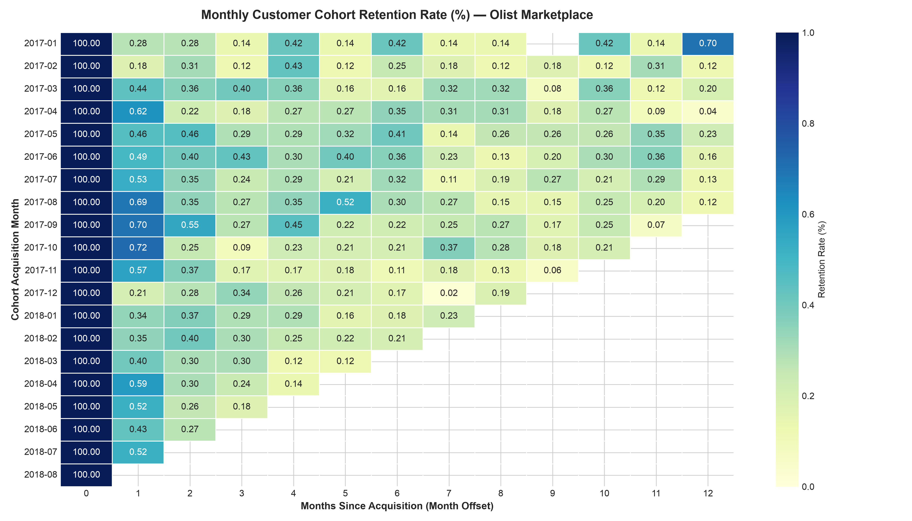
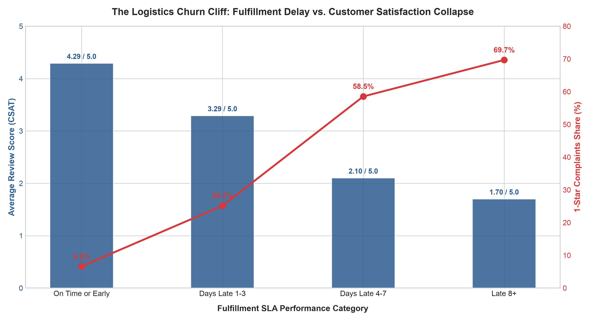

# 📊 Customer Lifecycle & Retention Dynamics: Cohort Analysis, RFM Segmentation, and Operational Churn Drivers

[-blue.svg)](#-tech-stack--repository-structure)
[-orange.svg)](#-dataset-overview--entity-grain)
[](#)

---

## 📌 Executive Summary

An end-to-end data analytics investigation examining customer retention curves, purchasing behaviors, and fulfillment bottlenecks across **100,000+ commercial transactions** from Brazilian e-commerce platform **Olist**.

By building an analytical pipeline in **SQL (DuckDB)**, this project demonstrates that Olist operates primarily as a **transactional discovery engine** rather than a habit-forming platform, with a steady-state **Month-1 retention rate of ~0.3%**. A behavioral **RFM segmentation** proves severe revenue concentration (**Pareto principle**): the top **16.7% of customers (`Champions`) generate 30.75% of platform GMV**. Finally, correlating logistics performance against customer reviews reveals a critical **operational tipping point**: delivery delays exceeding **3 days past the promised SLA date cause 1-star reviews to surge nearly 9x (from 6.6% to 58.5%)**, driving customer churn.

---

## 🎯 Business Context & Problem Statement

* **The Macro Challenge:** High Customer Acquisition Costs (CAC) require strong Customer Lifetime Value (LTV) driven by repeat purchase cycles.
* **The Marketplace Pain Point:** While new user acquisition is steady, repeat transactions are rare. The business lacked automated behavioral segmentation to isolate high-value accounts and catch churn risks.
* **The Operational Bottleneck:** Regional carrier fulfillment delays were suspected of harming customer sentiment and destroying repeat purchase potential.

### Core Research Questions
1. **RQ1 (Cohort Retention):** What is the longitudinal baseline retention rate across monthly cohorts, and do specific acquisition months show higher stickiness?
2. **RQ2 (Value Concentration & RFM):** How does the customer base segment across Recency, Frequency, and Monetary dimensions, and does cumulative GMV follow a Pareto distribution?
3. **RQ3 (Operational Tipping Point):** At what exact delivery delay threshold (actual arrival vs. promised SLA date) does customer satisfaction (CSAT) collapse into 1-star ratings?

---

## 🔍 Key Quantitative Findings

### Core Metric Summary
| Dimension | Key Metric | Business Finding |
| :--- | :---: | :--- |
| **Monthly Retention** | **~0.30%** | Baseline Month-1 repurchase rate across steady-state cohorts |
| **Revenue Concentration** | **30.75%** | Share of total platform GMV generated by top 16.7% of users (`Champions`) |
| **Logistics Churn Cliff** | **3 Days Late** | Threshold where 1-star reviews escalate from 6.63% to 58.54% |

---

### 1. Longitudinal Cohort Dynamics (RQ1)
* **Sub-1% Retention Curve:** Across all mature cohorts (2017–2018), 30-day retention ($M_1$) consistently lands between **0.20% and 0.50%**. For example, **Cohort 2017-01** retained only **2 out of 717 customers in Month 1 (0.28%)** and **1 customer in Month 3 (0.14%)**.
* **Marketplace Model:** Confirms the platform functions as an episodic, transactional discovery channel for durable goods rather than a recurring habit loop.

---

### 2. Behavioral RFM Segmentation & Pareto Distribution (RQ2)
* **Pareto Concentration:** The **`Champions`** tier represents only **16.72% of total customers (15,606 users)** but generates **30.75% of total realized GMV ($4,741,676.02)**.
* **High Dormancy:** **58.29% of customers (54,415 users)** sit in the **`Hibernating / Lost`** bucket.
* **High-ROI CRM Target:** A cohort of **994 repeat customers (1.06% of base)** are classified as **`At Risk`**, representing **$292,789.54 in historical GMV**.

| Segment | Total Customers | Customer Share (%) | Cumulative GMV ($) | GMV Share (%) | Primary Action |
| :--- | :---: | :---: | :---: | :---: | :--- |
| **Hibernating / Lost** | 54,415 | 58.29% | $8,619,048.39 | 55.89% | Low-cost re-engagement / purge |
| **Promising / Recent** | 21,736 | 23.28% | $1,585,080.67 | 10.28% | Automated onboarding cross-sell |
| **Champions** | 15,606 | 16.72% | $4,741,676.02 | 30.75% | VIP priority routing & concierge |
| **At Risk** | 994 | 1.06% | $292,789.54 | 1.90% | High-incentive win-back voucher |
| **Loyal Customers** | 606 | 0.65% | $183,867.15 | 1.19% | Loyalty perks & review advocacy |

---

### 3. Logistics SLA Tipping Point & CSAT Collapse (RQ3)

| Fulfillment Status | Orders Count | Share (%) | Avg CSAT (1-5) | 1-Star Share (%) | 5-Star Share (%) |
| :--- | :---: | :---: | :---: | :---: | :---: |
| **On Time or Early** | 89,944 | 93.3% | **4.29** | 6.63% | 62.26% |
| **1–3 Days Late** | 1,856 | 1.9% | **3.29** | 25.16% | 33.14% |
| **4–7 Days Late** | 1,756 | 1.8% | **2.10** | **58.54%** | 14.12% |
| **8+ Days Late** | 2,797 | 2.9% | **1.70** | **69.68%** | 7.04% |

* **The Warning Threshold (1–3 Days):** Average score drops by an entire point (from 4.29 to 3.29), while 1-star reviews surge nearly 4x to 25.16%.
* **The Critical Collapse (4+ Days):** At 4–7 days late, over half of customers (58.54%) leave 1-star ratings, worsening to nearly 70% at 8+ days.

---

## 💡 Strategic Recommendations

1. **Automated "At Risk" Win-Back Workflows (Marketing & CRM):**  
   Target the 994 `At Risk` repeat buyers with high-margin incentives ($15 voucher). Reclaiming even 15% recovers ~$44,000 in GMV at low CAC.
2. **Proactive SLA Delay Mitigation (Logistics & Support):**  
   Trigger automated apology notifications and shipping credits on Day 1 of delay, intercepting customer frustration before the Day 4 collapse.
3. **VIP Protection for Champions (Operations):**  
   Establish priority customer support queues and carrier fulfillment for the top 16.7% tier to protect 30.75% of platform GMV.

---

## 🛠 Tech Stack & Repository Structure

* **Database Engine:** [DuckDB](https://duckdb.org/) (In-process analytical SQL engine)
* **SQL Techniques:** Multi-stage CTEs, Window Functions (`NTILE`, `FIRST_VALUE`, `SUM() OVER()`), Date Differencing (`date_diff`, `DATE_TRUNC`), Conditional Logic (`CASE WHEN`).
* **Version Control:** Git & GitHub using [Conventional Commits](https://www.conventionalcommits.org/).

```text
ecommerce-customer-retention/
├── README.md                                  # Executive summary, findings, and strategy
├── .gitignore                                 # Excludes raw CSVs, DB binaries, and WAL files
└── sql/
    ├── 01_data_hygiene_and_sanity_checks.sql   # Entity grain validation, status breakdown, timestamp audit
    ├── 02_cohort_retention_matrix.sql          # Longitudinal cohort retention matrix (M0 to Mn)
    ├── 03_rfm_segmentation.sql                 # Quantile RFM scoring and Pareto GMV concentration
    └── 04_delivery_delay_csat_impact.sql       # Fulfillment delay tipping point vs. CSAT erosion
```
---

## 🗄 Dataset Overview & Entity Grain

Based on the [Brazilian E-Commerce Dataset by Olist](https://www.kaggle.com/datasets/olistbr/brazilian-ecommerce) (100K orders, 2016–2018).

* **Entity Grain:** Proved `customer_id` is an order transaction token (99,441 records). Retention modeling strictly groups by `customer_unique_id` (96,096 distinct customers, identifying 3,345 repeat buyers).
* **Order Status:** Filtered out unfulfilled transactions (`canceled`, `unavailable`), isolating 96,478 completed orders (`WHERE order_status = 'delivered'`).
* **Timestamp Consistency:** Audited and isolated 165 corrupted records where delivery preceded purchase creation.

---

## 🚀 How to Run

1. **Clone repository:**
   ```bash
   git clone https://github.com/YOUR_USERNAME/ecommerce-customer-retention.git
   cd ecommerce-customer-retention
   ```
2. **Setup Database:**
   Place Olist CSV files in the project root and execute DuckDB queries in sequence:
   * `sql/01_data_hygiene_and_sanity_checks.sql`
   * `sql/02_cohort_retention_matrix.sql`
   * `sql/03_rfm_segmentation.sql`
   * `sql/04_delivery_delay_csat_impact.sql`